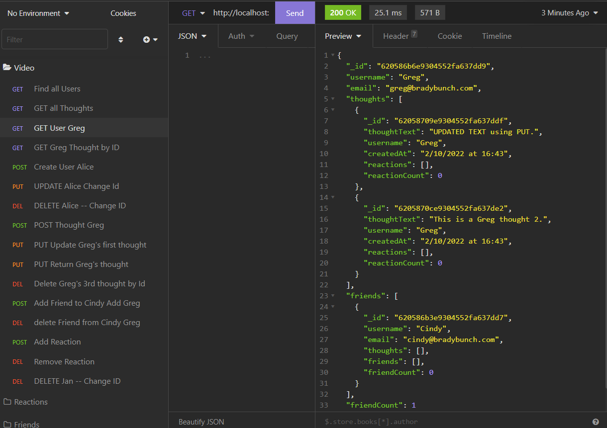

# train-of-thought
---

  
  
   
   
   
## Description

This is a social media API app.  It uses MongoDB and Mongoose to accomplish this goal.

---
  ## Table of Contents

  [Features](#features)

  [Screenshot](#screenshot)

  [Installation](#installation)
    
  [Usage](#usage)
    
  [License](#license)
    
  [Contributing](#contributing)

  [Questions](#questions)
  
  

---

## Features

      1. Users can  post or remove their thoughts from the database. 

      2. Users can add and remove their reactions to posted thoughts.

      3. Users can add friends and remove friends.

      4. Users can be added and removed from the database and the associated thoughts are remove with them. 

      5. Tech used: Mongoose, MongoDB, Node, Express

     
---

## Screenshot 
  
  
 

  [Here is a link to a video showing me using Train of Thought to use API calls to interact with the Database]( https://watch.screencastify.com/v/FfuMSsactjQknrvWWpu0)

  ---

  ## Installation

      1. Clone the git repository

      2. type npm i 

      3. type npm start to run 
---
  ## Usage

      1. Type npm start from the root directory 

  ---
  ## License 

  &emsp; 

      To read about the license of this project click the link below.

  &emsp;[License](https://github.com/tgtiburon/train-of-thought/blob/main/LICENSE) 

  ---
  ## Contributing

      1. Email me or post an issue in my git issues. 

---
## Questions

If you have any questions about this project feel free to email me at <tg.tiburon@gmail.com>.  

To see the rest of my portfolio, visit [Github](https://github.com/tgtiburon).

Below is a graphic displaying my most used languages on github.

This Readme file was created with Readme Architect by Tony Gendreau &copy;
